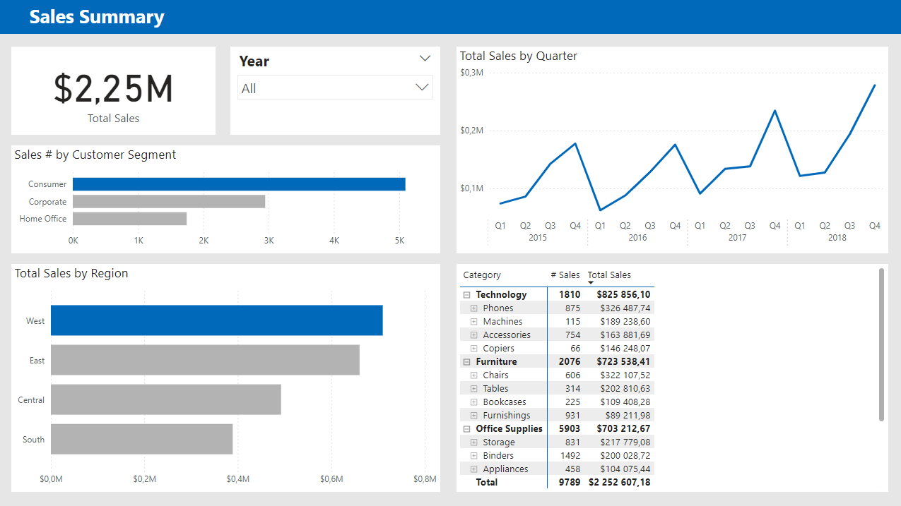
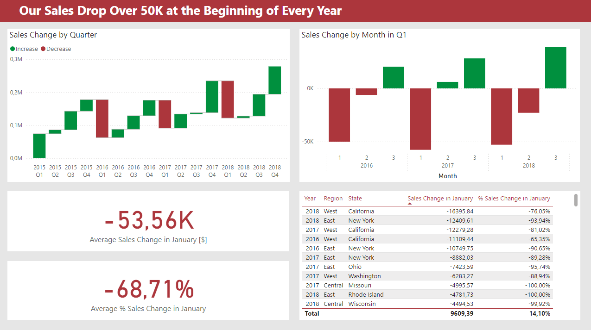
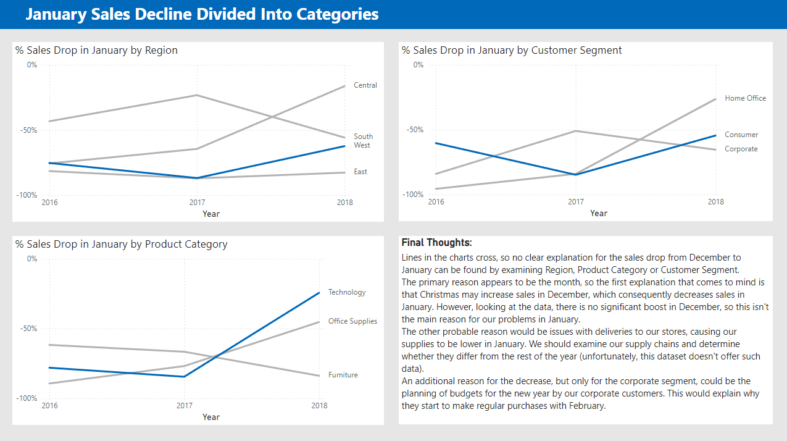

# supermarket_sales_project
Data in this project comes from https://www.kaggle.com/datasets/rohitsahoo/sales-forecasting/data

The objective of this project is to create a sales summary dashboard for a supermarket chain using Power BI and to provide valuable insights into sales behavior.
Additionally, the project involves conducting further analysis to uncover the reasons behind sales declines.

